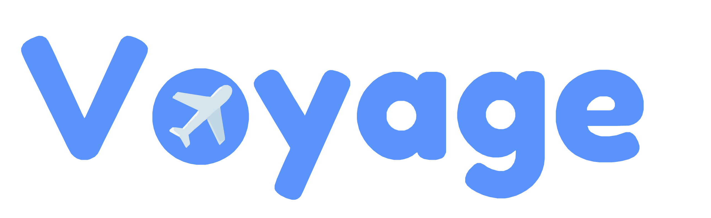
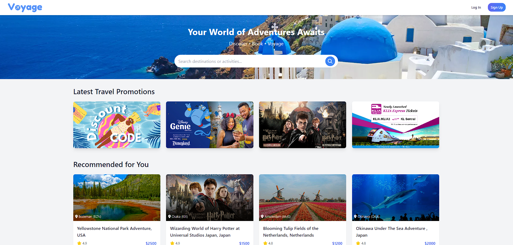
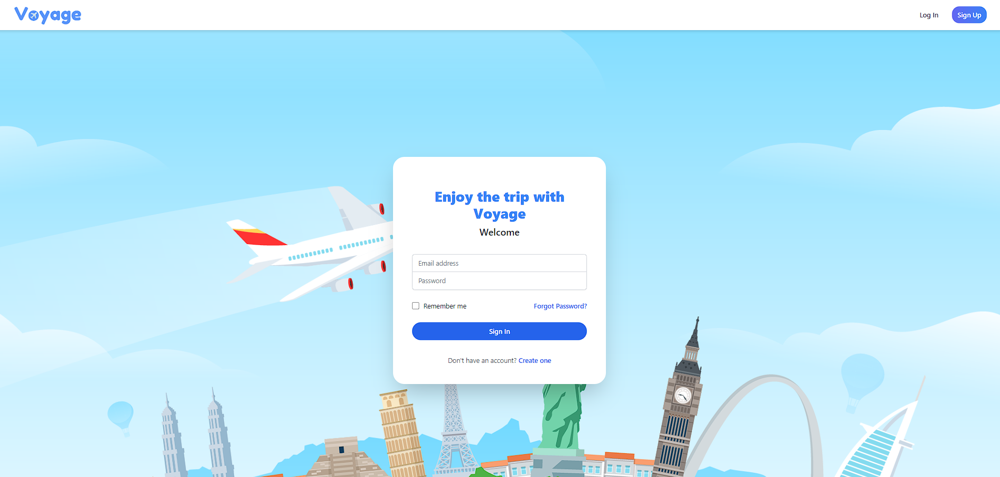
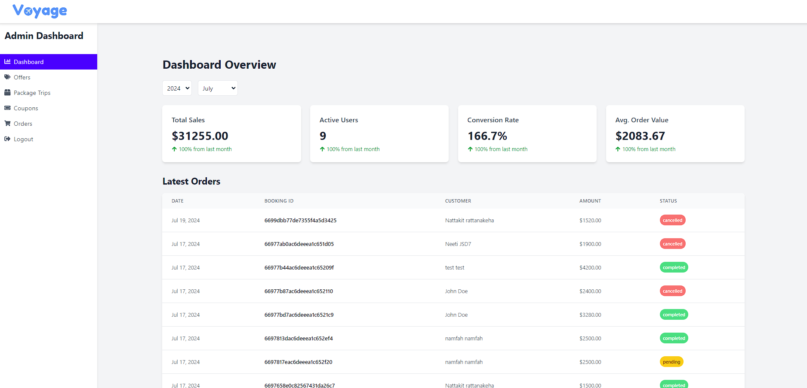

# Voyage - Curated Travel Package Platform (MERN Stack)



Voyage is a revolutionary travel platform that offers a seamless and personalized experience for modern travelers. Our curated travel packages solve the pain points of traditional travel booking processes.

## Table of Contents

- [Features](#features)
- [Technology Stack](#technology-stack)
- [Getting Started](#getting-started)
- [Development Process](#development-process)
- [Future Plans](#future-plans)
- [Contributing](#contributing)
- [License](#license)
- [Team](#team)

## Features

### User Side

- Personalized Booking: Browse and book travel packages with options for individual bookings.
- Intuitive UI: Easy-to-use interface for exploring and discovering perfect travel destinations.
- Discount Codes: Functional discount code system for savings on travel bookings.



_Landing page showcasing curated travel packages_



_User-friendly login interface_

### Admin Side

- Package Management: Create and design new travel packages.
- Discount Code Creation: Generate and manage discount codes.
- Order Management: Track and manage user bookings and orders.



_Admin dashboard for managing travel packages and bookings_

## Technology Stack

1. **MongoDB & Cloudinary**:

   - MongoDB for storing and managing schemas for travel packages and user profiles.
   - Cloudinary for storing images.

2. **Node.js / Express**:

   - APIs for booking management and other functionalities.

3. **React**:

   - Responsive and user-friendly frontend developed using React with Vite.
   - Styled with Tailwind CSS.

4. **Authentication**:
   - JWT-based user authentication system for personalized features and secure transactions.

## Getting Started

To get started with the Voyage project:

1. Clone the repository:

   ```
   git clone https://github.com/your-username/voyage.git
   cd voyage
   ```

2. Install dependencies for both client and server:

   ```
   cd client
   npm install
   cd ../server
   npm install
   ```

3. Set up environment variables:

   - Create a `.env` file in the server directory and add necessary environment variables (e.g., MongoDB connection string, JWT secret, etc.)

4. Start the server:

   ```
   cd server
   npm start
   ```

5. In a new terminal, start the client:

   ```
   cd client
   npm run dev
   ```

6. Open your browser and visit `http://localhost:5173` to see the application running.

## Development Process

Our development process evolved throughout the project:

1. **Initial Role Assignments**: Distributed roles based on individual strengths and project needs.
2. **Feature-Based Task Allocation**: Transitioned to full frontend and backend responsibility per feature.
3. **Evolution to Comprehensive Ownership**: Implemented full frontend and backend responsibility to ensure cohesive integration and robust development.

## Future Plans: Voyage Community

We aim to evolve Voyage into a vibrant social ecosystem for travelers:

- Develop robust social media features for sharing experiences, photos, and videos.
- Implement a user-friendly hashtag and location tagging system.
- Allow users to create and share engaging travel stories.
- Craft a holistic travel experience that seamlessly integrates with various aspects of our users' lives.

## Contributing

We welcome contributions to the Voyage project! Here's how you can contribute:

1. Fork the repository on GitHub.
2. Clone your forked repository to your local machine.
3. Create a new branch for your feature or bug fix: `git checkout -b feature/your-feature-name` or `git checkout -b fix/your-bug-fix`.
4. Make your changes and commit them with a clear and descriptive commit message.
5. Push your changes to your fork on GitHub.
6. Create a pull request from your fork to the main Voyage repository.

Please ensure your code adheres to our coding standards and include tests for new features or bug fixes.

## License

This project is licensed under the MIT License. See the [LICENSE](LICENSE) file for details.

## Team

- Nattakit Rattanakeha - Full-stack Developer
- Pat Boonsom - Full-stack Developer
- Anon Kreethawate - Full-stack Developer
